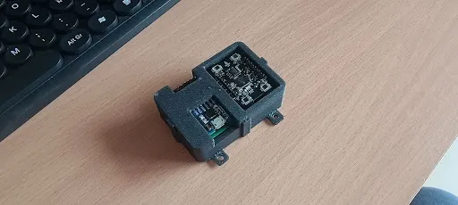
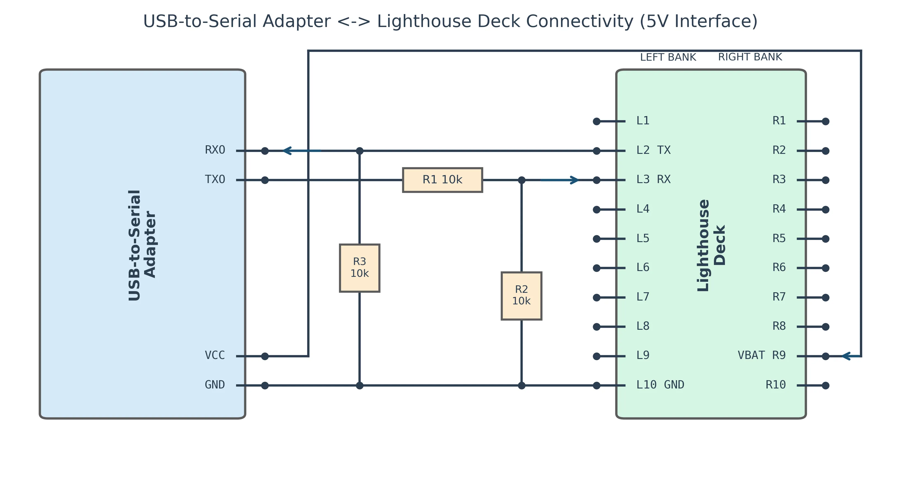

# Lighthouse ROS 2

Build your own low-cost motion capture system using ROS 2 and the Valve Lighthouse Positioning system.

## Overview

[Lighthouse](https://en.wikipedia.org/wiki/Lighthouse_(virtual_reality)) is a localization system developed by Valve for the [HTC Vive](https://en.wikipedia.org/wiki/HTC_Vive) VR system. It uses a combination of infrared-emitting base stations and sensors to track the position and orientation of objects in 3D space with excellent accuracy and low latency.

The [Lighthouse Positioning Deck](https://www.bitcraze.io/products/lighthouse-positioning-deck/) is a small receiver board originally designed for the [Crazyflie](https://www.bitcraze.io/products/crazyflie-2-1-plus/) nano drone from Bitcraze. It contains an FPGA and four infrared sensors that can track the deck's position and orientation relative to one or more Lighthouse base stations.

This repository provides ROS 2 packages that interface with the Lighthouse Positioning Deck through a simple USB-to-serial adapter, enabling you to build a low-cost motion capture system for robotics applications. The packages handle protocol decoding, station calibration, and real-time pose tracking.

https://github.com/user-attachments/assets/7652e270-2aea-4834-9b63-033b9ceaf312

## Hardware Requirements

To build the adapter and use these packages, you will need the following hardware:

1. **Lighthouse Base Stations**: Up to four V2 Lighthouse base stations are supported. Notice that V1 base stations are not supported at this time.

2. **Lighthouse Positioning Deck**: [Bitcraze Lighthouse Positioning Deck](https://www.bitcraze.io/products/lighthouse-positioning-deck/)

3. **USB-to-Serial Adapter**: Any common USB-to-serial adapter (FTDI FT232, CP2102, CH340, etc.)

4. **Electronic Components** (for the adapter):
   - Resistors: 3x 10kΩ
   - XBee breakout board (e.g., [SparkFun BOB-08276](https://www.sparkfun.com/products/8276))
   - Breadboard or perfboard
   - Jumper wires and basic soldering tools

## Getting Started

### 1. Build the Hardware Adapter

Build the USB-to-serial adapter following the instructions in the [Building the Hardware Adapter](#building-the-hardware-adapter) section below.

### 2. Connect the Adapter

Connect your assembled adapter to the computer via USB. The deck should appear as a serial device (e.g., `/dev/ttyUSB0` or `/dev/ttyACM0` on Linux).

Verify the connection:
```bash
ls /dev/tty* | grep -E "(USB|ACM)"
```

### 3. Build the Docker Container

Build and run the development docker container:

```bash
./docker/run.sh --build
```

### 4. Build the ROS 2 Workspace

Once inside the docker container, build the workspace:

```bash
colcon build --symlink-install
. install/setup.bash
```

### 5. Run Interactive Station Mapping

Launch the interactive mapper to calibrate your Lighthouse base stations:

```bash
ros2 launch lighthouse_station_mapper interactive_mapping.launch.py device:=/dev/ttyACM0
```

See the [lighthouse_station_mapper README](lighthouse_station_mapper/README.md) for detailed workflow instructions.

## ROS 2 Nodes

This repository provides three main ROS 2 nodes that work together to enable lighthouse-based tracking:

### lighthouse_deck_driver

The driver node interfaces with the Lighthouse Positioning Deck hardware via USB-to-serial connection. It handles the low-level protocol decoding and publishes raw angle measurements from the deck's sensors.

**Key features:**
- Communicates with the deck's FPGA over serial
- Decodes binary lighthouse protocol
- Publishes raw azimuth/elevation measurements for each base station

See the [lighthouse_deck_driver README](lighthouse_deck_driver/README.md) for detailed node documentation, including published topics, parameters, and usage examples.

### lighthouse_station_mapper

An interactive terminal-based calibration tool that computes the 3D geometry of your lighthouse base stations. You move the deck to multiple positions while the tool collects measurements and solves for station poses using nonlinear optimization.

**Key features:**
- Interactive TUI for guided calibration workflow
- Real-time RViz visualization of stations and sample positions
- Exports calibrated station geometry to CSV
- Sends station poses to the localization node

See the [lighthouse_station_mapper README](lighthouse_station_mapper/README.md) for detailed node documentation, including the calibration workflow, topics, and parameters.

### lighthouse_localization

The localization node computes real-time 6-DOF pose estimates of the lighthouse deck using the calibrated station geometry. Once the stations are mapped, this node provides continuous pose tracking at high rates with low latency.

**Key features:**
- Real-time pose optimization using Ceres Solver
- Configurable solver rate and time synchronization
- Loads pre-calibrated station maps from file
- Service interface for dynamic station pose updates

See the [lighthouse_localization README](lighthouse_localization/README.md) for detailed node documentation, including subscribed/published topics, services, and parameters.

## Building the Hardware Adapter



The Lighthouse deck requires a USB-to-serial adapter to interface with a computer. The adapter circuit requires voltage level shifting to protect the deck's FPGA, which operates at **3.0V logic levels**.

**Important:** While the deck's TX pin can safely connect to most USB-to-serial adapters, **the RX pin must be protected with a voltage divider** to prevent damage from higher voltage levels (5V or 3.3V) output by typical USB-to-serial adapters.

The recommended adapter circuit is shown in the wiring diagram below:



## Contributing

Contributions are welcome! This implementation provides a foundation with many opportunities for improvement.

Please open issues for bug reports or feature requests, and submit pull requests for improvements.

## References

### Essential Reading

- [Lighthouse Positioning System: Dataset, Accuracy, and Precision for UAV Research](https://arxiv.org/abs/2104.11523)
- [Repurposing Valve's SteamVR 2.0 Technology to Develop an Open-Source, Low-Cost Motion Capture System for Robotics](https://fosdem.org/2025/schedule/event/fosdem-2025-5013-repurposing-valve-s-steamvr-2-0-technology-to-develop-an-open-source-low-cost-motion-capture-system-for-robotics/) - FOSDEM 2025 talk with low-level system details

### Bitcraze Resources

- [Lighthouse deck product page](https://www.bitcraze.io/products/lighthouse-positioning-deck/)
- [Lighthouse positioning accuracy analysis](https://www.bitcraze.io/2021/05/lighthouse-positioning-accuracy/)
- [Improved geometry estimation](https://www.bitcraze.io/2022/01/improved-lighthouse-geometry-estimation/)
- [Lighthouse documentation](https://www.bitcraze.io/documentation/repository/crazyflie-firmware/master/functional-areas/lighthouse/)
- [ROSCon 2024 presentation](https://roscon.ros.org/2024/talks/The_Lighthouse_project_-_from_Virtual_Reality_to_Onboard_Positioning_for_Robotics.pdf)

## Acknowledgements

This project builds upon extensive work by the Lighthouse community, but especial thanks to the following community members for their contributions:

- **Bitcraze** for creating and open-sourcing the Lighthouse deck hardware and firmware
- **Said Alvarado-Marin** for the excellent FOSDEM presentation and slides
- The broader **Crazyflie and VR communities** for documentation and support

## License

See [LICENSE](LICENSE) for details.
